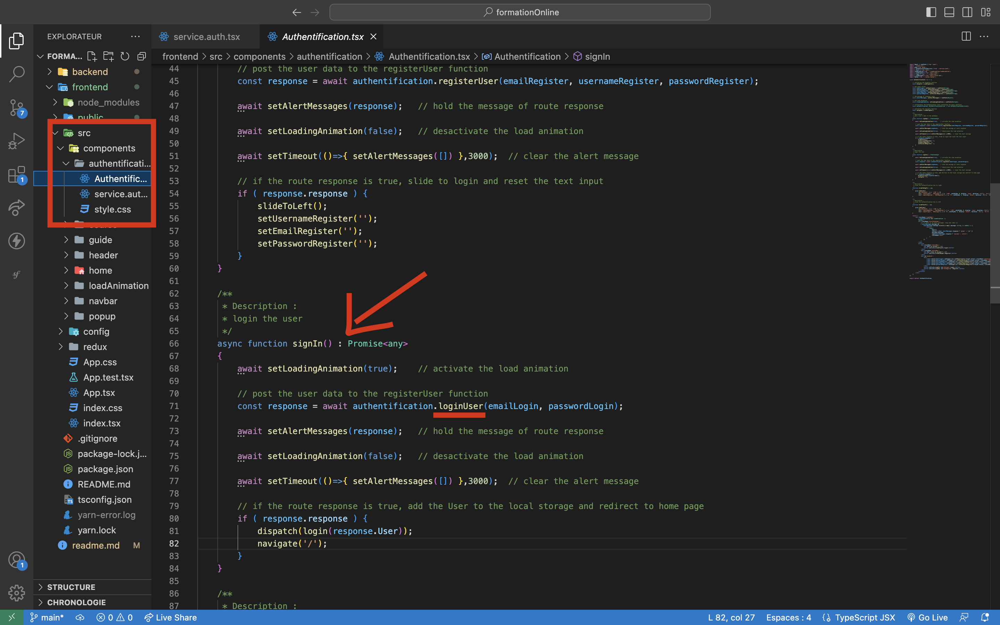
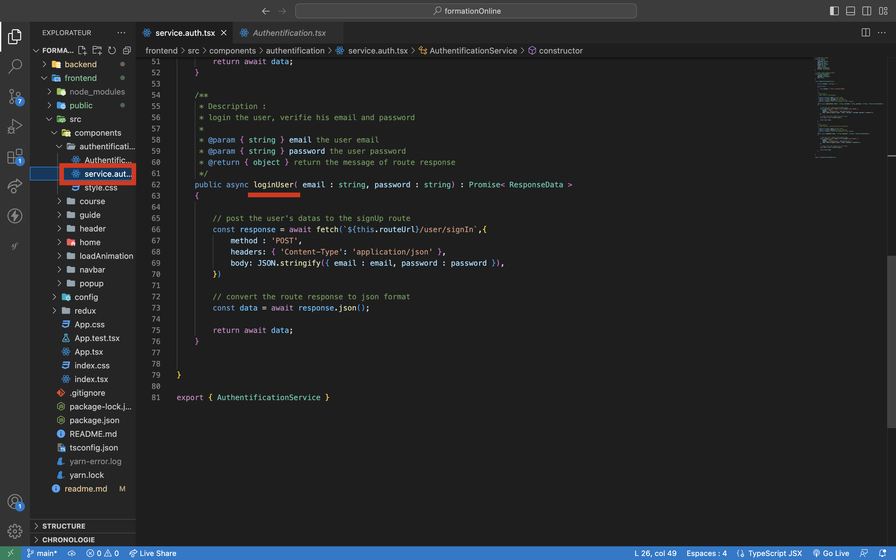

# Frontend développement

Voila comment j'ai organisé chaque controller

- controler : manipulations des donnée 
- service : fonctions qui font des requêtes en base de donnée

Voici un exemple :

J'ai séparé les fonctions fetch qui font des requete au controller qui se contente de manipuler les données du front

1. Je récupère les données des inputs
2. J'utilise ma fonction qui envoie les données des inputs dans la fonction qui s'occupe de faire la requête vers le back
3. Je récupère la réponse du fetch et je términe le reste de la fonction du controller

cette organisation me permet de bien structurer mon code et de le rendre lisible.
J'ai utilisé cette ogranisation dans tout mes controller.

Exemple :

  

  

