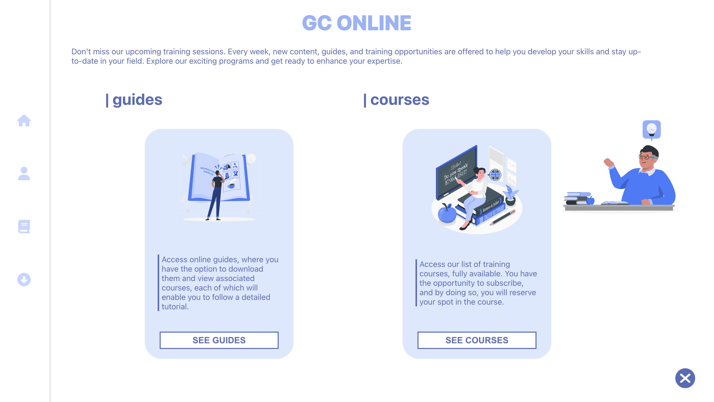

<div id="" align="center">
  
</div>

# Présentation :
Guides et Cours en ligne est une applications web qui permet de de visiter des guides (tuto) pour se reperer et par la suite vous avez la possibiltié de reserver des formations.

## lien du site : https://guide-course-frontend.vercel.app/

# Technologie utilisée

Frontend :
- React (framework)
- Typescript (langage)
- gsap (librarie)
- css (langage)
- antd (librarie)
- redux (librarie)

Backend :
- Node js (plateforme logicielle)
- Typescript (langage)
- Nest js (framework)
- Class-transformer (librarie)
- Class-validator (librarie)
- Uid2 (librarie)
- Bcrypt (librarie)

Database :
- MongoDB

## lancer l'applications en local 

### Prérequis : 

- Node js
- Nest js

Tapez ces lignes de commande dans votre terminal :


`````
cd frontend
yarn install
yarn start
`````


# Développeur 

Ezechiel Felten </br>

feltenezechiel1@gmail.com</br>
[linkedin](https://www.linkedin.com/in/ezechiel-felten-475693248/)</br>
[portfolio](https://ezechiel-felten.vercel.app/)</br>
